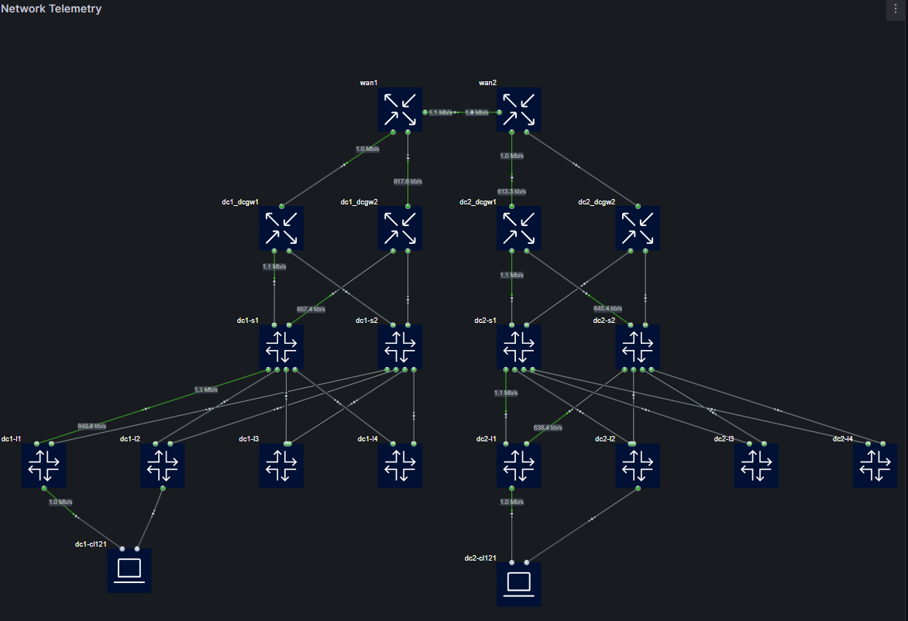
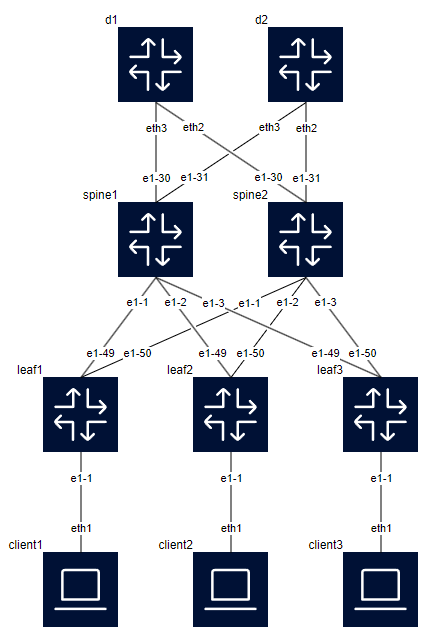
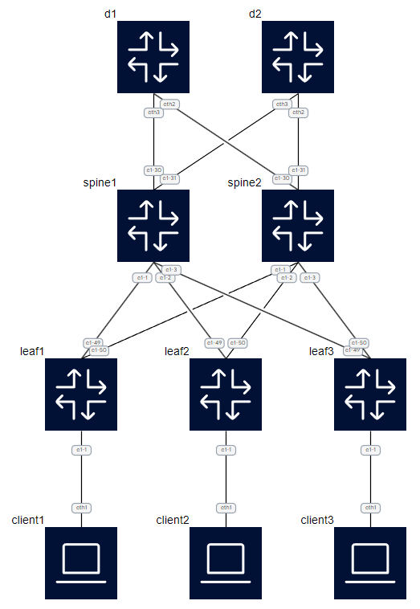

# clab2drawio

**`clab2drawio`** automatically generates network topology diagrams from Containerlab
YAML files, outputting them as visually appealing Draw.io diagrams. 
It can optionally create [Grafana](./grafana.md) dashboards 
for real-time network monitoring.

<p align="center">
  
</p>


## Features

- **Automatic Diagram Generation**: Produces detailed Draw.io diagrams in vertical 
  or horizontal layouts.
- **Graph-level-Based Layout**: Organizes nodes based on `graph-level` labels 
  in the YAML, which can be edited interactively with `-I`.
- **Fixed Position Support**: Respects exact node positions defined in YAML files
  for pixel-perfect control over diagram layouts.
- **Node Icon Customization**: Utilizes `graph-icon` labels to specify icons 
  (e.g., `router`, `switch`, `host`).
- **Customizable Styles**: Users can apply or create custom Draw.io themes
- **Grafana Dashboards**: Generates Grafana dashboards for monitoring node and link 
  states. See [grafana.md](./grafana.md) for details.
  <p align="center">
  
</p>

## Usage
To generate a network topology diagram from a containerlab YAML file, run the following command:

```bash
clab2drawio -i <path_to_your_yaml_file>
```
or
```bash
containerlab graph --drawio -t <path_to_your_yaml_file> 
```
> [!NOTE]
> By default, the `.drawio` file is saved in the same folder as the input YAML. 
> Use `-o` to specify a different path.

> [!TIP]
> Use `-I` for an interactive mode that prompts for `graph-level` and `graph-icon` if you have them not set in clab.yml
> labels.

## Interactive Mode

A user-friendly way to organize your topology is using the interactive TUI mode:

```bash
clab2drawio -i <path_to_your_yaml_file> -I
```

<p align="center">


</p>

## Advanced Usage

### Influencing Node Placement

You have multiple ways to control node placement in your diagrams:

#### 1. Using Graph Levels

Configure graph levels in your YAML files through `graph-level` labels:

```bash
client1:
  kind: "linux"
  labels:
    graph-level: 1 # This node will be placed towards the top of the canvas
    graph-icon: host # This node will use the client icon
```
```bash
spine1:
  kind: "linux"
  labels:
    graph-level: 2  # This node will be placed below graph-level 1 nodes on the canvas
    graph-icon: switch # This node will use the switch icon
```
> [!TIP]
> Lower `graph-level` values place nodes toward the top or left (depending on layout).
> Higher values push them further down or to the right.

#### 2. Using Fixed Positions

For precise control of node positions, you can specify exact coordinates:

```bash	
client1:
  kind: "linux"
  labels:
    graph-posX: 100  # X coordinate on the canvas (in pixels)
    graph-posY: 200  # Y coordinate on the canvas (in pixels)
    graph-icon: host
```

When fixed positions are specified, they take precedence over graph levels.

#### 3. Using VS Code TopoViewer

The easiest way to create perfect layouts is using the VS Code Containerlab extension's TopoViewer:

1. Install the [VS Code Containerlab extension](https://marketplace.visualstudio.com/items?itemName=srl-labs.vscode-containerlab)
2. Right-click on your lab file and select "Open in TopoViewer"
3. Arrange your nodes by dragging them to desired positions
4. Click "Save Layout" - this automatically updates your YAML file with precise positions
5. Run clab2drawio to create a Draw.io diagram that uses exactly the same layout

> [!TIP]
> The TopoViewer approach is highly recommended for complex topologies as it provides a visual, intuitive way to create perfect node arrangements that clab2drawio will faithfully reproduce.

### Command-Line Arguments

`clab2drawio` supports several command-line arguments to customize the diagram generation process. Use these arguments to fine-tune the output according to your specific requirements:

- `-i, --input`: Specifies the filename of the input file. This file should be a containerlab YAML for diagram generation. This argument is required.

     ```bash
     clab2drawio -i <path_to_your_yaml_file>
     ```

- `-o, --output`: Specifies the output file path for the generated diagram in draw.io format. 

     ```bash
     clab2drawio -i <path_to_your_yaml_file> -o <path_to_output_file>
     ```
- `-g, --gf_dashboard`: Generates a Grafana dashboard in Grafana style. 

     ```bash
     clab2drawio -i <path_to_your_yaml_file> -g --theme grafana
     ```
- `--grafana-config`: Path to a Grafana YAML config file. If omitted, defaults are used. 

     ```bash
     clab2drawio -i <path_to_your_yaml_file> -g --theme grafana --grafana-config <path_to_your_cfg_file>
     ```

- `--grafana-interface-format`: Maps interface names for Grafana export using regex patterns. This allows you to transform interface names to match your monitoring system's naming conventions.

     ```bash
     clab2drawio -i <path_to_your_yaml_file> -g --grafana-interface-format "e1-{x}:ethernet1/{x}"
     ```

     This would convert interface names like `e1-1` to `ethernet1/1` in the Grafana dashboard.

- `--grafana-interface-selector`: Selects which part of the interface name to display as the port label using regex patterns with capture groups.

     ```bash
     clab2drawio -i <path_to_your_yaml_file> -g --grafana-interface-selector "e1-1-c{x}-1"
     ```

     This would extract and display only the captured digit (e.g., from `e1-1-c3-1` it would display `3` as the port label).

    For more detailed information about this feature, including compatibility, usage guidelines, and future enhancements, please see the [Grafana Dashboard Documentation](./grafana.md).

- `--include-unlinked-nodes`: Include nodes without any links in the topology diagram. By default, only nodes with at least one connection are included.

- `--no-links`: Do not draw links between nodes in the topology diagram. This option can be useful for focusing on node placement or when the connectivity between nodes is not relevant.

- `--layout`: Specifies the layout of the topology diagram (either `vertical` or `horizontal`). The default layout is `vertical`.

- `--theme`: Specifies the theme for the diagram (`nokia`,  `nokia_modern`, or ... ) or the path to a custom style config file. By default, the `nokia` theme is used. Users can also create their own style file and place it in any directory, specifying its path with this option. Feel free to contribute your own styles.

     ```bash
     clab2drawio --theme nokia_dark -i <path_to_your_yaml_file>
     ```
    
    Or using a custom style file:

     ```bash
     clab2drawio --theme <path_to_custom_style_file> -i <path_to_your_yaml_file>
     ```

- `-I`, `--interactive`: Define graph-levels and graph-icons in interactive mode

- `-l`, `--log-level`: Set logging level (`critical`, `error`, `warning`, `info`, `debug`). Default is `info`.


---

### Customization

You can apply different style themes such as `nokia`, `nokia_modern` or `grafana`:

```bash
clab2drawio --theme nokia_modern -i <path_to_yaml>
```

> [!TIP]
> Create your own style file and specify it with `--theme /path/to/stylefile.yml`. Or place it in styles, than you can just use it like `nokia_modern`


### Example Styles

| Theme          | Preview                               |
| :------------: | :------------------------------------: |
| **nokia**      |          |
| **nokia_modern** |      |
| **grafana**    |             |

> [!NOTE] 
> drawio diagrams created with default_labels: true, cannot be used by drawio2clab
---

### Custom Styles
To customize styles, you can edit or copy the `example.yaml` configuration file. This file defines the base style, link style, source and target label styles, and custom styles for different types of nodes based on their roles (e.g., routers, switches, servers).

An example snippet from `nokia.yaml`:
```yaml
#General Diagram settings:
background: "none"
shadow: "0"
grid: "0"
pagew: "auto"
pageh: "auto"

node_width: 75
node_height: 75

padding_x: 150
padding_y: 175

base_style: "shape=image;imageAlign=center;imageVerticalAlign=middle;labelPosition=left;align=right;verticalLabelPosition=top;spacingLeft=0;verticalAlign=bottom;spacingTop=0;spacing=0;"
link_style: "endArrow=none;jumpStyle=gap;"
src_label_style: "verticalLabelPosition=bottom;verticalAlign=top;align=left;spacingLeft=1;spacingTop=1;spacingBottom=0;"
trgt_label_style: "verticalLabelPosition=top;verticalAlign=bottom;align=left;spacingLeft=1;spacingTop=1;spacingBottom=0;"
custom_styles:
  default: "image=data:image/png;base64,..."
  spine: "image=data:image/png;base64,..."
  leaf: "image=data:image/png;base64,..."
  dcgw: "image=data:image/png;base64,..."
  server: "image=data:image/png;base64,..."
icon_to_group_mapping:
  router: "dcgw"
  switch: "leaf"
  host: "server"
```

> [!TIP]
> For users looking to further customize their diagrams with more advanced styling options, such as custom icons, specific dimensions, or additional visual attributes, you can directly edit the styles within the Draw.io interface.
> To get the style data from Draw.io for a specific element:
> 1. Create or select the element in your Draw.io diagram.
> 2. Right-click on the element and select "Edit Style" from the context menu.
> 3. A style definition string will be displayed in a text box. 
> 
> You can copy this string and incorporate it into your custom style file or directly modify it within Draw.io for immediate effect.

## Further Documentation & References

- [Containerlab Documentation](https://containerlab.dev)
- [clab2drawio.md](./clab2drawio.md)
- [drawio2clab.md](./drawio2clab.md)
- [grafana.md](./grafana.md)

